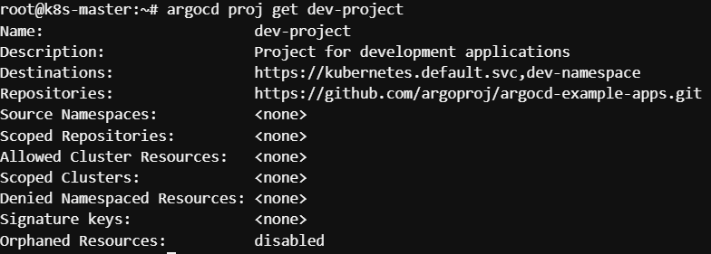

# Task 3 - Project (Repo, NS, Resource 제한)


1. 프로젝트 yaml 생성

```
cat <<EOF > dev-proj.yaml
apiVersion: argoproj.io/v1alpha1
kind: AppProject
metadata:
  name: dev-project
  namespace: argocd
spec:
  description: Project for development applications
  sourceRepos:
    - https://github.com/argoproj/argocd-example-apps.git
  destinations:
    - namespace: dev-namespace
      server: https://kubernetes.default.svc
  namespaceResourceWhitelist:
    - group: apps
      kind: Deployment
    - group: ""
      kind: ConfigMap
EOF
```


2. dev-proj.yaml 로 생성

```
kubectl apply -f dev-proj.yaml
```


3. 생성 확인&#x20;

```
argocd proj list
```

```
argocd proj get dev-project
```

<figure><figcaption></figcaption></figure>


4. dev-project 프로젝트에서 허용되지 않은 레포지토리를 사용 시도

```
argocd app create invalid-repo-app \
  --project dev-project \
  --repo https://github.com/invalid/repo.git \
  --path guestbook \
  --dest-server https://kubernetes.default.svc \
  --dest-namespace dev-namespace
```

<figure><figcaption></figcaption></figure>


5. dev-project 프로젝트에서 허용되지 않은 네임스페이스 시도

```
argocd app create invalid-namespace-app \
  --project dev-project \
  --repo https://github.com/argoproj/argocd-example-apps.git \
  --path guestbook \
  --dest-server https://kubernetes.default.svc \
  --dest-namespace test-namespace
```

<figure><figcaption></figcaption></figure>

6. Application 생성

```
argocd app create guestbook-dev \
  --project dev-project \
  --repo https://github.com/argoproj/argocd-example-apps.git \
  --path guestbook \
  --dest-server https://kubernetes.default.svc \
  --dest-namespace dev-namespace
```


7. 동기화를 통해 오브젝트 생성시도 및 실패 메시지 확인

```
argocd app sync guestbook-dev
```

<figure><figcaption></figcaption></figure>


8. Application 삭제

```
argocd app delete guestbook-dev

y
```

<figure><figcaption></figcaption></figure>

9. Project 삭제

```
kubectl delete -f dev-proj.yaml
```


